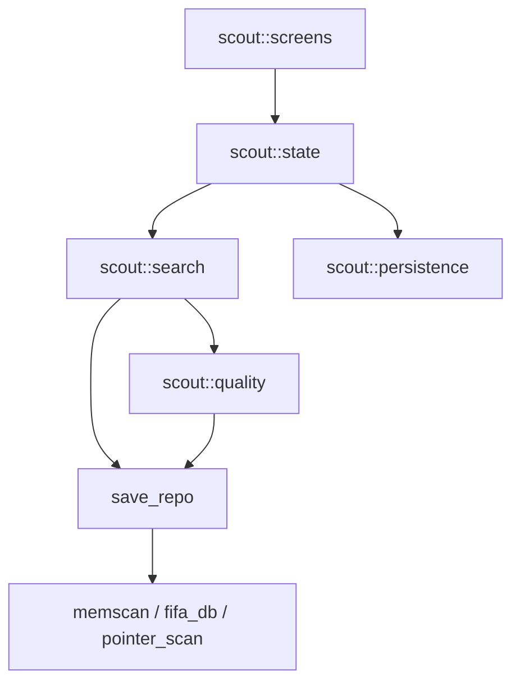
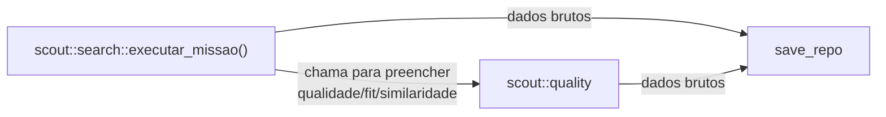
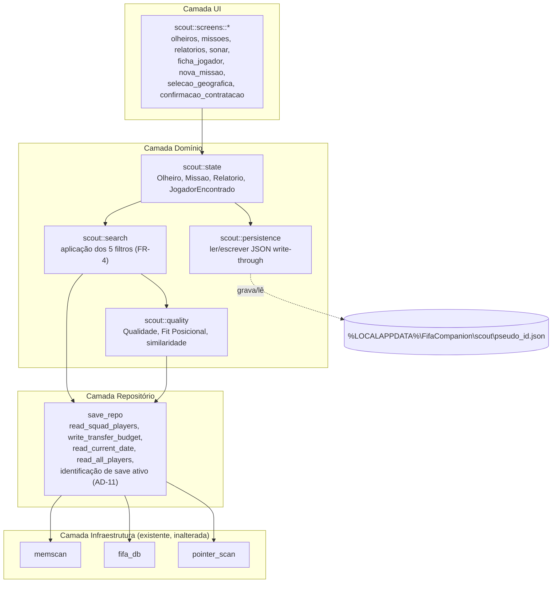
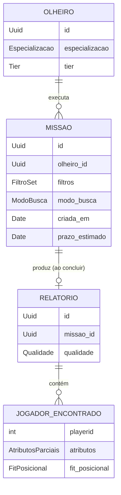

# Architecture Spine — Central de Scout

## Design Paradigm

**Arquitetura em Camadas (Layered)**, 4 camadas, dependência estritamente unidirecional de cima para baixo:

```
scout::screens   (UI — ImGui, uma tela por arquivo)
      │  depende de
      ▼
scout            (Domínio — state, search, quality, persistence)
      │  depende de
      ▼
save_repo        (Repositório — vocabulário de domínio sobre dados brutos)
      │  depende de
      ▼
memscan / fifa_db / pointer_scan   (Infraestrutura — leitura/escrita de memória crua)
```

Mapeamento de namespaces (todos dentro do crate `fifa_overlay`):

| Camada | Módulo Rust |
| --- | --- |
| UI/Screens | `fifa_overlay::scout::screens::*` |
| Domínio | `fifa_overlay::scout::{state, search, quality, persistence}` |
| Repositório | `fifa_overlay::save_repo` |
| Infraestrutura | `fifa_overlay::{memscan, fifa_db, pointer_scan}` (já existentes, inalterados) |

## Invariants & Rules

### AD-1 — Dependência unidirecional entre camadas, incluindo dentro do Domínio

- **Binds:** todo o módulo `scout::*` e `save_repo`.
- **Prevents:** uma tela acessando `save_repo` sem passar pelo domínio; o domínio ou uma tela chamando `memscan`/`fifa_db` diretamente; qualquer camada inferior conhecendo uma camada superior; dentro da camada de Domínio, múltiplos pontos de entrada não coordenados para `scout::persistence` (ex.: uma tela mutando preferência de UI direto em `persistence`, outra rotina passando por `state` — dois caminhos de escrita divergentes para o mesmo arquivo).
- **Rule:** uma camada só pode chamar a camada imediatamente abaixo dela na lista do Design Paradigm. Nunca pular camadas, nunca depender de baixo para cima. **Dentro da camada de Domínio**, o grafo de chamadas é fixo: `scout::screens` só chama `scout::state`; `scout::state` é o único chamador de `scout::persistence` (nunca `search`/`quality` diretamente) e o único orquestrador de `scout::search`/`scout::quality`. Toda mutação — de entidade de domínio ou de preferência de UI (`ui_prefs`) — passa por `scout::state` antes de chegar em `persistence`. `search` e `quality` nunca chamam `persistence`.



### AD-2 — `save_repo` é a única porta para `memscan`/`fifa_db`

- **Binds:** `scout::*`, `save_repo`.
- **Prevents:** lógica de bit-packing/offset binário vazando para dentro do domínio do Scout; duplicação de conhecimento de formato de save em múltiplos lugares.
- **Rule:** `save_repo.rs` é o único módulo autorizado a chamar `memscan`/`fifa_db`/`pointer_scan`. `scout::*` só conhece `save_repo`. `save_repo` expõe funções de alto nível no vocabulário de domínio (ex: `read_squad_players() -> Result<Vec<Player>, SaveRepoError>`, `write_transfer_budget(i32) -> Result<(), SaveRepoError>`, `read_current_date() -> Result<Date, SaveRepoError>`), nunca offsets/tabelas cruas.

### AD-3 — `save_repo` é burro: filtros e cálculo de domínio vivem em `scout::search`/`scout::quality`; `search` é o orquestrador

- **Binds:** `save_repo`, `scout::search`, `scout::quality`.
- **Prevents:** `save_repo` acumulando regras de negócio (o que é um "bom filtro", como calcular Fit Posicional) que deveriam ser puramente do domínio Scout; ambiguidade sobre quem monta o `Relatorio` final (duas implementações plausíveis — `search` chamando `quality`, ou o inverso — produzindo contratos de função incompatíveis entre si).
- **Rule:** `save_repo` retorna sempre dados brutos (`Vec<PlayerRaw>`, valores escalares). A aplicação dos 5 filtros do FR-4 (geográfico, Overall/Potencial, atributo dominante, Fit Posicional, Jogador de Referência) vive em `scout::search`. O cálculo de Qualidade, Fit Posicional e similaridade vive em `scout::quality`. `save_repo` nunca recebe um "critério de filtro" como parâmetro. **`scout::search::executar_missao(missao) -> Relatorio` é o único orquestrador**: filtra os candidatos (responsabilidade própria) e chama `scout::quality` internamente para preencher `qualidade`/`fit_posicional`/`similaridade`, devolvendo o `Relatorio` já completo para `scout::state` persistir (via AD-1). `scout::quality` nunca chama `scout::search` — a dependência é unidirecional `search → quality`, nunca o inverso.



### AD-4 — Toda operação assíncrona usa `AsyncTask<T>`, com API pública fixa

- **Binds:** todas as operações concorrentes do Scout (execução de busca de Missão, qualquer leitura futura potencialmente pesada).
- **Prevents:** repetição manual do trio `enum State + Arc<Mutex<State>> + Arc<AtomicBool>` (já duplicado 3× no código existente antes desta feature); scans pesados bloqueando a thread de render; duas implementações de `TaskState<T>` com variantes/semântica de leitura incompatíveis (erro embutido em `T` vs. estado irmão; leitura por referência vs. por consumo), que quebrariam qualquer `screens::*` escrito contra a outra convenção.
- **Rule:** um tipo genérico `AsyncTask<T>` (novo, generaliza o padrão já `[ADOPTED]` em `lib.rs`) encapsula `Arc<Mutex<TaskState<T>>>` + `Arc<AtomicBool>`, com API pública fixa:
  ```rust
  enum TaskState<T> { Idle, Running, Done(T), Failed(SaveRepoError) }
  impl<T> AsyncTask<T> {
      fn poll(&self) -> TaskState<T> where T: Clone { /* ... */ } // leitura não destrutiva (clona o estado), idempotente — chamável a cada frame do render() sem consumir o resultado
  }
  ```
  - `Failed` é sempre uma variante **irmã** de `Done`, nunca embutida dentro de `T` (evita colidir com o `Result<T, SaveRepoError>` de AD-5 — o erro já tipado de `save_repo` popula `Failed`, não vira um `T = Result<...>` aninhado).
  - `poll()` nunca consome o estado — `screens::*` pode chamá-lo em todo frame (ImGui é modo imediato) sem perder o resultado após a primeira leitura.
  - Toda função de `save_repo`/`scout` cuja operação varre `CZUM` inteira (~32k registros) **deve** retornar/disparar um `AsyncTask<T>`, nunca ser chamada síncrona dentro de `render()`. Leituras de campo único ou tabela pequena (`read_current_date`, `read_transfer_budget`, `read_squad_players` — elenco do usuário, ~30 jogadores) são sempre síncronas.
  - O preview de custo/tempo/Qualidade estimada do Formulário Nova Missão (`EXPERIENCE.md`, resumo fixo no rodapé, recalculado a cada mudança de filtro) é sempre um cálculo síncrono sobre metadados já em memória (Tier, Especialização, Modo de Busca, amplitude geográfica selecionada) — nunca consulta `save_repo`, portanto cai fora do escopo de `AsyncTask<T>` por definição, podendo rodar a cada frame sem custo perceptível.
  - A convenção de nomenclatura (assinatura retorna `Result<T, _>` direto vs. dispara um `AsyncTask<T>`) torna a distinção visível na assinatura da função — isso é convenção de projeto, não uma garantia forçada pelo compilador; cabe à revisão de código (não a este documento) impedir uma função pesada sendo escrita como síncrona por engano.

### AD-5 — Erros do `save_repo` são tipados

- **Binds:** `save_repo`, `scout::*` (consumidor).
- **Prevents:** UI genérica de erro sem diferenciar causa; falhas de leitura de memória silenciosas.
- **Rule:** toda função pública de `save_repo` retorna `Result<T, SaveRepoError>`. `SaveRepoError` é um enum com no mínimo as variantes `TabelaNaoEncontrada`, `ProcessoInacessivel`, `CarreiraNaoCarregada`. `scout::*` trata cada variante explicitamente, mapeando para os estados já definidos em `EXPERIENCE.md` (`CarreiraNaoCarregada` → estado vazio; `ProcessoInacessivel` → mensagem de erro com retry).

### AD-6 — Navegação de tela é uma pilha com raiz fixa e reset ao reabrir

- **Binds:** `scout::mod` (estado raiz do Scout).
- **Prevents:** lógica especial por nível de aninhamento; estado de "tela anterior" perdido ou hardcoded para 1 nível só; ambiguidade sobre o que fazer quando a pilha esvazia; comportamento de reabertura divergente do que `EXPERIENCE.md` (Fluxo 1) exige ("painel abre na última aba usada").
- **Rule:** a tela ativa é modelada como `Vec<ScoutScreen>` (pilha). **A pilha nunca fica vazia**: o elemento `stack[0]` é sempre a aba ativa (uma das 4 abas fixas) e não é poppável — `pop()` chamado com `stack.len() == 1` é no-op. Fechar/abrir o painel é um `bool painel_aberto` **separado** da pilha, não derivado dela. Abrir uma tela satélite (Ficha de Jogador, Formulário, Painel de Seleção Geográfica) = `push`. Voltar = `pop` (nunca esvazia `stack[0]`). **Ao fechar o painel** (`painel_aberto = false`), a pilha é resetada para `vec![ultima_aba_ativa]` (`stack.truncate(1)`) — reabrir sempre cai na aba de topo, nunca resume dentro de uma tela satélite empurrada anteriormente, conforme `EXPERIENCE.md` Fluxo 1. Profundidade máxima de 2 (aba → tela satélite) é mecânica, não só convenção de UX: `push` além do nível 2 é recusado e loga aviso via `tracing::warn!`.
- **Emenda (Story 3.2, 2026-10-03):** a profundidade máxima passa a **3 telas satélite** sobre a aba (`MAX_SATELITES = 3`). O caminho Relatórios → Relatório → Ficha de Jogador → Seletor de elenco (comparação) precisa de três. Continua mecânico: o quarto `push` é recusado com `tracing::warn!`.

### AD-7 — Escrita do estado é write-through através de um único lock nomeado

- **Binds:** `scout::persistence`.
- **Prevents:** divergência entre estado em memória e em disco; perda de dados em crash do jogo com o painel aberto; preferências de UI (última aba aberta, densidade Tabular/Cards — exigidas pelo `EXPERIENCE.md` como persistentes entre sessões) implementadas como um mecanismo de persistência paralelo e não documentado; **lost update** entre a thread de background que conclui uma Missão (AD-8) e a thread de render mutando `ui_prefs` no mesmo instante — cada uma lendo o arquivo, aplicando sua mudança, e sobrescrevendo a versão da outra sem saber que ela existiu.
- **Rule:** existe um único `Arc<Mutex<ScoutStateFile>>` vivendo em `scout::persistence`, compartilhado entre a thread de render e qualquer `AsyncTask` que produza uma mutação de domínio. Toda mutação — de estado do domínio (contratar Olheiro, criar Missão, arquivar Relatório etc.) **ou** de preferência de UI persistente (aba ativa, densidade escolhida) — só pode acontecer através desse mutex: travar → ler o estado atual em memória → aplicar a mudança → serializar → escrever o arquivo JSON inteiro → destravar. Nenhuma mutação escreve o arquivo por fora desse ponto único, independente de qual thread a originou (render ou background). O JSON de estado por save (AD-11, AD-12) carrega uma seção `ui_prefs` além das entidades de domínio.

### AD-8 — Missão: busca dispara na transição de reabertura, com guard contra redisparo

- **Binds:** `scout::search`, `scout::state` (entidade `Missao`).
- **Prevents:** resultado de Missão "congelado" no instante da contratação; scan desnecessário disparado antes do prazo; disparo contínuo por polling enquanto o painel fica aberto (comportamento não previsto: Missão "vence" no meio de uma sessão longa com o painel parado em segundo plano); Missão "travada" indefinidamente se o painel nunca for fechado e reaberto após o prazo vencer; segundo `AsyncTask` disparado para a mesma Missão se o painel for fechado/reaberto antes do primeiro terminar (scan duplicado da `CZUM`).
- **Rule:** `Missao` carrega um campo de status (`Pendente | EmExecucao | Concluida`). Ao criar uma `Missao`, apenas os critérios de filtro são persistidos com status `Pendente` — nenhum `AsyncTask` de busca é disparado. A checagem de prazo acontece **exclusivamente na transição de borda** `painel_aberto: false -> true` (evento único do AD-6, nunca um polling contínuo enquanto o painel permanece aberto). Nessa transição, para cada `Missao` com status `Pendente` cujo prazo estimado já passou (via `save_repo::read_current_date()`), dispara-se o `AsyncTask` de busca real contra `save_repo::read_all_players()` e o status muda para `EmExecucao` **antes** do disparo — isso é o guard: uma `Missao` já `EmExecucao` nunca dispara um segundo `AsyncTask`, mesmo que o painel seja fechado e reaberto de novo enquanto o primeiro ainda roda. Um `AsyncTask` de Missão já em andamento continua rodando mesmo que o usuário feche o painel (sobrevive ao ciclo de vida da UI); ao terminar, grava o `Relatorio` via write-through (AD-7) e muda o status para `Concluida`.
- **Emenda (Story 2.10, 2026-10-01, pedido do Felipe — Relatório parcial e Missão contínua):** a busca deixa de esperar o prazo. Na mesma transição de borda, toda `Missao` `Pendente` que ainda não buscou os jogadores dos blocos pagos (`blocos_buscados < blocos`) vira `EmExecucao` antes do disparo (o guard continua igual) e entra na fila do AD-9. Ao terminar, os jogadores são **anexados** ao `Relatorio` da Missão na ordem de descoberta (embaralhada de forma determinística pelo id da Missão), e a Missão volta a `Pendente` — ou vira `Concluida` se o prazo fixo já passou. O Relatório é **revelado aos poucos**: a tela mostra `ceil(progresso × alvo)` jogadores, com o progresso calculado na data guardada na abertura do painel (FR-8 continua sem polling). Na borda, uma `Missao` de prazo fixo com a busca feita e o prazo cumprido vira `Concluida` sem nova busca. Uma Missão **contínua** é paga em blocos de 30 dias de carreira; ao fim do bloco ela fica `Pendente` até o jogador **renovar** (uma compra com confirmação explícita, como qualquer escrita de orçamento — FR-3/NFR1; nunca há cobrança automática) ou **encerrar** (os jogadores já revelados viram o Relatório final). Com o painel fechado, a releitura de 1 s que já existe compara os jogadores revelados na data viva com os já anunciados (`Relatorio.notificados`) e mostra o banner "Relatório atualizado" (Story 1.7); isso não é polling de busca — nenhuma varredura é disparada fora da borda.

### AD-9 — Missões vencidas simultaneamente executam em fila FIFO sequencial

- **Binds:** `scout::search` (orquestração de execução de Missão); qualquer operação futura que varra `CZUM` inteira (ver Nota de escopo abaixo).
- **Prevents:** múltiplos scans pesados de `CZUM` rodando ao mesmo tempo, competindo por CPU/memória; ordens de conclusão diferentes entre implementações (uma por `prazo_estimado`, outra por `criada_em`) causando UX inconsistente (ordem em que Relatórios aparecem prontos).
- **Rule:** quando mais de uma `Missao` vence o prazo na mesma transição de reabertura (AD-8), `scout::search` mantém uma **única fila FIFO** (`VecDeque<Uuid>` de IDs de Missão) processada por uma única thread de worker — nunca disparando dois `AsyncTask`s de busca simultâneos. Ordenação: por `prazo_estimado` ascendente (a que venceu há mais tempo primeiro); em empate, por `criada_em` ascendente. A fila não é um lock global do Scout inteiro (ver AD-10).
- **Nota de escopo:** hoje o único consumidor de scan pesado de `CZUM` é a execução de Missão. Se uma feature futura precisar de outro scan pesado independente (ex.: uma eventual evolução do Sonar de Cobertura, FR-11, que hoje é somente-leitura sobre dados já persistidos), ela **deve** entrar nesta mesma fila — a fronteira desta AD é por **recurso compartilhado** (qualquer operação que varra `CZUM` inteira), não por categoria de domínio "Missão".

### AD-10 — `AsyncTask`s são independentes, exceto os que competem pelo mesmo recurso pesado (`CZUM` inteira)

- **Binds:** todo uso de `AsyncTask<T>` no Scout.
- **Prevents:** uma operação leve e não relacionada (ex: abrir o Seletor de elenco, ler um campo único) ficando bloqueada esperando um scan pesado de `CZUM` terminar; ao mesmo tempo, uma segunda feature com scan pesado próprio escapando da fila do AD-9 só porque "não é uma Missão".
- **Rule:** cada preocupação assíncrona tem seu próprio `AsyncTask<T>` isolado; não existe semáforo global do Scout. A **única** exceção é a fila FIFO do AD-9, cujo critério de pertencimento é **consumir `CZUM` inteira** (recurso compartilhado pesado), não ser uma "Missão" — leituras leves (um campo, o elenco de ~30 jogadores) nunca entram na fila e nunca esperam por ela.

### AD-11 — Identificação do save ativo é via memória, hash SHA-256 como nome de arquivo

- **Binds:** `save_repo` (função de identificação de save), `scout::persistence` (nomeação do arquivo).
- **Prevents:** apontar silenciosamente para o save errado quando o usuário carrega uma carreira antiga sem salvar nesta sessão (falha real da heurística de `mtime` usada pelo lado Python); nome de arquivo inválido/crash quando `firstname`/`surname` do manager contém acentos, espaços ou caracteres reservados do Windows (`\ / : * ? " < > |`); duas implementações do pseudo-ID gerando nomes de arquivo diferentes para o mesmo save (concatenação crua vs. hash), perdendo silenciosamente o histórico já persistido ao trocar de convenção.
- **Rule:** os **componentes** do pseudo-ID são lidos inteiramente da memória do processo em execução, nunca do sistema de arquivos: `GJUr.startdate` (data de criação da carreira) + `mPrV.firstname`/`surname` (manager) + `mPrV.clubteamid` (clube controlado). O **nome de arquivo** nunca usa esses componentes crus — é sempre `SHA-256(startdate + "|" + firstname + "|" + surname + "|" + clubteamid)`, formatado em hex lowercase (`<hash>.json`). O hash garante nome de arquivo sempre válido no Windows, independente de caracteres especiais nos componentes de origem. `[ASSUMPTION]` `GJUr.startdate` ainda não foi lido/validado como estável ao longo de múltiplas sessões da mesma carreira — validar isso é a primeira tarefa técnica ao implementar esta regra (a existência dos campos `GJUr.startdate`/`mPrV.clubteamid` já foi confirmada no metadata real do FIFA 16; o que falta validar é a estabilidade temporal de `startdate`, não sua existência).
- **Consequência para o UX:** o arquivo por save (um JSON isolado por hash de pseudo-ID) elimina por design o cenário de "Missões de um save diferente" — `EXPERIENCE.md` (State Patterns) ainda modela um aviso "ver mesmo assim/descartar" para esse cenário, que fica **obsoleto** com esta AD. `[NOTE FOR PM]` recomendar remover/simplificar esse estado numa próxima atualização do UX.

### AD-12 — IDs de entidade são UUID v4 (exceto `JogadorEncontrado`, que usa `playerid` como chave natural)

- **Binds:** `scout::state` (structs `Olheiro`, `Missao`, `Relatorio`).
- **Prevents:** colisão de ID; necessidade de sincronizar um contador incremental; IDs instáveis após arquivamento/remoção; UUID redundante em `JogadorEncontrado`, que já tem uma chave natural (`playerid`, o ID nativo do FIFA) e não participa de nenhuma referência cruzada por UUID na spine.
- **Rule:** `Olheiro`, `Missao` e `Relatorio` recebem um `Uuid` (crate `uuid`, feature `v4`) na criação, serializado em JSON como string (formato canônico `uuid::Uuid::to_string()`, ex. `"550e8400-e29b-41d4-a716-446655440000"`). Referências cruzadas usam o UUID (`Missao.olheiro_id`, `Relatorio.missao_id`), nunca índice de posição em lista. **`JogadorEncontrado` não recebe `Uuid` próprio** — é identificado por `playerid` (chave natural do FIFA, já único por definição no save), conforme o diagrama ER do Structural Seed.

### AD-13 — Seletor de elenco é um componente único, reutilizado por dois papéis, sem exceção às regras de camada

- **Binds:** `scout::screens::nova_missao` (FR-7, filtro de busca), `scout::screens::ficha_jogador` (FR-10, comparação visual), `scout::state` (fachada obrigatória).
- **Prevents:** duas implementações divergentes da mesma lista de elenco (uma para escolher Jogador de Referência ao criar a Missão, outra para escolher o jogador a comparar no Radar) — exatamente o tipo de duplicação que o `EXPERIENCE.md` já identifica como o "mesmo componente reaproveitado em dois momentos distintos"; uma tela violando AD-1/AD-2 ao chamar `save_repo` diretamente só porque "é uma leitura simples"; duplicação de gerenciamento de estado de abrir/fechar/voltar entre as duas telas hospedeiras, mesmo compartilhando a renderização.
- **Emenda (Story 3.2, 2026-10-03) — leitura do elenco é assíncrona:** desde a Story 2.4 os jogadores vêm do arquivo `DATA` do save ativo, não da memória; decodificá-lo leva ~0,5 s, mesmo para filtrar só o elenco. `listar_elenco_atual()` continua sendo a única porta das telas, mas dispara `save_repo::read_squad_players()` num `AsyncTask` próprio e devolve `EstadoElenco::{Carregando, Pronto, Erro}`. O resultado é marcado com a carreira dona e relido uma vez por abertura do painel. Não entra na fila do AD-9: nada espera por ele e ele não espera por nada (AD-10). As menções a `read_squad_players` "síncrono" no AD-4 e abaixo valem com esta emenda.
- **Rule:** existe um único arquivo `scout::screens::seletor_elenco`, **sem exceção às regras de camada do AD-1**: ele chama `scout::state::listar_elenco_atual()` (nunca `save_repo` diretamente), que por sua vez chama `save_repo::read_squad_players()` (síncrono, conforme AD-4). `nova_missao.rs` e `ficha_jogador.rs` invocam `seletor_elenco`, nunca duplicam a lógica de listar o elenco. `SeletorElenco(contexto: SeletorElencoContexto)` — onde `contexto` é `FiltroMissao` ou `ComparacaoFicha` — é uma variante de `ScoutScreen` empurrada na pilha do AD-6 como qualquer outra tela satélite, nunca um overlay de estado local mantido separadamente por cada tela hospedeira; isso garante que o botão de cancelar do gamepad (Interaction Primitives, `EXPERIENCE.md`) funcione de forma idêntica aqui e em qualquer outro ponto do app.

### AD-14 — Atalho do painel Scout via polling de tecla com edge-trigger

- **Binds:** `scout::mod` (estado raiz), `lib.rs` (ponto de chamada dentro de `render()`).
- **Prevents:** ambiguidade sobre como um atalho "distinto do atalho que abre/fecha o overlay em si" (PRD FR-1) é implementado, dado que `ImguiRenderLoop` hoje só implementa `render()` — sem `before_wnd_proc`/`message_filter` para captura de mensagens de input em nível de janela; disparo repetido do toggle a cada frame enquanto a tecla permanece pressionada (sem detecção de borda).
- **Rule:** o atalho é lido via polling de `windows::Win32::UI::Input::KeyboardAndMouse::GetAsyncKeyState` **dentro** de `render()` (mesma thread, sem nova thread — é uma leitura de estado de tecla, não uma operação pesada). `scout::mod` guarda um `bool tecla_estava_pressionada` para detecção de borda (edge-trigger): o toggle de `painel_aberto` (AD-6) só acontece na transição `false -> true` da tecla, nunca em polling contínuo enquanto pressionada. Feature `Win32_UI_Input_KeyboardAndMouse` precisa ser adicionada à lista de features do crate `windows` no Stack.

## Consistency Conventions

| Concern | Convention |
| --- | --- |
| Naming (entidades, arquivos, módulos) | `snake_case` para funções/campos/arquivos, `PascalCase` para structs/enums — convenção `[ADOPTED]` já em vigor no crate. Sufixo `_state` para enums de estado assíncrono, `_in_progress` para `AtomicBool`, prefixo `spawn_*_thread` para funções que disparam thread (ou, pós-AD-4, construtores de `AsyncTask`). Uma tela por arquivo em `scout/screens/`, nome do arquivo em `snake_case` do nome da tela (`olheiros.rs`, `nova_missao.rs`, `selecao_geografica.rs`, `ficha_jogador.rs`, `confirmacao_contratacao.rs`, `missoes.rs`, `relatorios.rs`, `sonar.rs`). |
| Data & formats (ids, datas, erros) | IDs: `Uuid` v4 serializado como string canônica (AD-12; `JogadorEncontrado` usa `playerid: i32` como chave natural). Datas: `struct Date(i32)` — newtype `#[serde(transparent)]` sobre o inteiro `YYYYMMDD` cru, mesma forma já lida de `GJUr.currdate` — serializa em JSON como `"prazo_estimado": 20261015`, nunca como struct aninhada (`{year,month,day}`) nem string ISO-8601; qualquer conversão para exibição (ex. "pronto em ~N dias") é responsabilidade de `scout::screens`, não do formato persistido. Erros: `Result<T, SaveRepoError>` na fronteira do repositório (AD-5), quando assíncrono (AD-4), o erro vai na variante irmã `Failed(SaveRepoError)` de `TaskState<T>` — nunca embutido em `T`; dentro do domínio, `Option`/`Result` conforme já convencionado no crate — nunca `panic!`/`unwrap()`/`expect()` (convenção `[ADOPTED]`). Indexação de slice sempre via `.get(a..b)`, nunca `&slice[a..b]` (convenção `[ADOPTED]`, bug histórico documentado). |
| State & cross-cutting (mutação, logging, persistência) | Mutação de estado do domínio sempre write-through (AD-7). Logging via `tracing::info!`/`warn!` com tag de origem entre colchetes, ex: `"[scout::search] ..."` (convenção `[ADOPTED]`, estendida ao novo módulo). Comentários de módulo (`//!`) em português explicando o porquê, não só o quê (convenção `[ADOPTED]`). Toda leitura/escrita de memória crua via `ReadProcessMemory`/`WriteProcessMemory` protegido, nunca deref de ponteiro Rust cru (convenção `[ADOPTED]`, ver AD-2 para a fronteira que isola isso do domínio). |

## Stack

| Name | Version |
| --- | --- |
| Rust (edition) | 2021 (`[ADOPTED]`, inferido do `Cargo.toml` existente) |
| hudhook (feature `dx11`) | 0.9 (`[ADOPTED]`, resolvido 0.9.3) |
| imgui | 0.12 (`[ADOPTED]`, resolvido 0.12.0) |
| windows | 0.62 (`[ADOPTED]`, resolvido 0.62.2) — feature nova `Win32_UI_Input_KeyboardAndMouse` requerida por AD-14 |
| memchr | 2.7 (`[ADOPTED]`, resolvido 2.8.3) |
| tracing / tracing-subscriber / tracing-appender | 0.1 / 0.3 / 0.2 (`[ADOPTED]`) |
| serde (feature `derive`) | 1.0 — verificado 2026-09-22, atual 1.0.229 |
| serde_json | 1.0 — verificado 2026-09-22, atual 1.0.151 |
| uuid (features `v4`, `serde`) | 1.26 — verificado 2026-09-22, atual 1.26.1 |
| dirs | 7.0 — verificado 2026-09-22, atual 7.0.0 |
| sha2 | 0.10 — adicionado na Story 1.1 (AD-11), resolvido 0.10.9 em 2026-09-30 |
| windows (features extras) | `Win32_System_LibraryLoader`, `Win32_Storage_FileSystem` — Story 1.1, verificação da build via string `ProductVersion` do `fifa16.exe` (NFR4) |

## Structural Seed





`[NOTE FOR PM]` O arquivo de estado por save (AD-11) também carrega uma seção `ui_prefs` (aba ativa, densidade Tabular/Cards — ver AD-7) fora das entidades de domínio acima; omitida do ERD por não ser uma entidade de negócio.

Árvore de arquivos (só o que é novo/alterado; `memscan.rs`, `fifa_db.rs`, `pointer_scan.rs`, `lib.rs` existentes permanecem):

```text
fifa_overlay/
  src/
    lib.rs                      # ImguiRenderLoop::render passa a despachar
                                 # para scout::render_active_screen(...) quando
                                 # o painel Scout está aberto
    async_task.rs                # AD-4: AsyncTask<T> genérico
    save_repo.rs                 # AD-2: única porta para memscan/fifa_db
    scout/
      mod.rs                     # ScoutScreen enum, Vec<ScoutScreen> (AD-6), dispatch
      state.rs                   # Olheiro, Missao, Relatorio, JogadorEncontrado
      search.rs                  # aplicação dos 5 filtros (FR-4) — AD-3
      quality.rs                 # Qualidade, Fit Posicional, similaridade — AD-3
      persistence.rs              # leitura/escrita write-through (AD-7), pseudo-ID (AD-11)
      screens/
        olheiros.rs
        missoes.rs
        relatorios.rs
        sonar.rs
        ficha_jogador.rs
        nova_missao.rs
        selecao_geografica.rs
        confirmacao_contratacao.rs
        seletor_elenco.rs          # componente compartilhado — ver AD-13
```

## Capability → Architecture Map

| Capability / Área (PRD) | Lives in | Governed by |
| --- | --- | --- |
| FR-1 (abrir/fechar painel) | `lib.rs` (chamada dentro de `render()`) + `scout::mod` | AD-6, AD-14 |
| FR-2, FR-3 (contratação de Olheiro) | `scout::screens::{olheiros, confirmacao_contratacao}`, `scout::state::Olheiro` | AD-5, AD-7, AD-12 |
| FR-4, FR-5, FR-6, FR-7 (Missão + 5 filtros + Modo de Busca) | `scout::screens::{missoes, nova_missao, selecao_geografica, seletor_elenco}`, `scout::search` | AD-3, AD-4, AD-8, AD-9, AD-13 |
| FR-8 (progresso de Missão) | `scout::screens::missoes`, `save_repo::read_current_date` | AD-8 |
| FR-9, FR-10 (Relatório + Radar) | `scout::screens::{relatorios, ficha_jogador, seletor_elenco}`, `scout::quality` | AD-3, AD-13 |
| FR-11 (Sonar de Cobertura) | `scout::screens::sonar` | — |
| Orçamento de Scouting (`transferbudget`) | `save_repo::write_transfer_budget` | AD-2, AD-5 |
| Persistência do estado do Scout | `scout::persistence` | AD-7, AD-11, AD-12 |

## Deferred

- **Fórmula exata de Qualidade** (Tier × Especialização × Modo de Busca × amplitude geográfica → precisão/atributos-revelados/quantidade). `scout::quality` existe como módulo; a fórmula concreta é uma decisão de balanceamento a fazer durante a implementação, não estrutural.
- **Fórmula exata de Fit Posicional e de similaridade com Jogador de Referência**. Mesma razão — vivem em `scout::quality`/`scout::search`, mas o cálculo em si é conteúdo, não invariante.
- **Fórmula exata de custo de contratação/Missão** por combinação Especialização × Tier × Modo de Busca × amplitude geográfica. Tabela de balanceamento a construir na implementação.
- **Validação de `GJUr.startdate`** como campo estável (AD-11 assume isso; precisa ser confirmado empiricamente antes de confiar em produção).
- **Núcleo de olheiros detalhistas** (2ª etapa de aprofundamento) — fora do escopo do PRD v1, não modelado aqui.
- **Escrita de atributos de jogador individuais** — permanece bloqueada conforme `PROJECT_MEMORY.md`; esta spine não tenta resolver isso, e nenhuma AD depende de resolver.
- **Limite de slots simultâneos de Olheiros** — `[ASSUMPTION]` do PRD mantida (sem limite no v1); não há AD estrutural associada.
- **Detecção automática de tela do FIFA (M1)** — permanece pausada; o Scout não depende disso (FR-1 já assume painel "sempre disponível").
- **Risco de performance de leitura contínua em sessão longa** (PRD Questão em Aberto #6): a sessão 5 do `PROJECT_MEMORY.md` já validou que um scan completo de `CZUM` roda em thread separada (~17s, sem travar o render) — mas o impacto de **múltiplos** `AsyncTask`s concorrentes (AD-10) ao longo de uma sessão de jogo prolongada não foi medido. Não vira AD agora porque é uma questão empírica (medir FPS/uso de CPU em uso real), não uma decisão estrutural; candidato a validação já nas primeiras stories de implementação do módulo `scout::search`.
